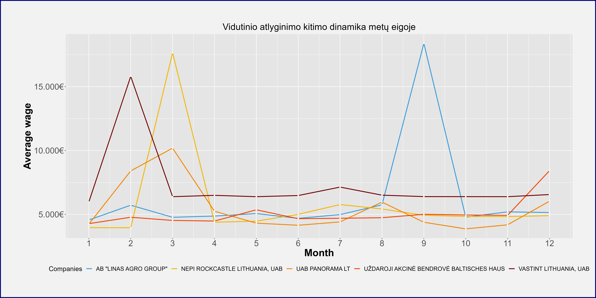
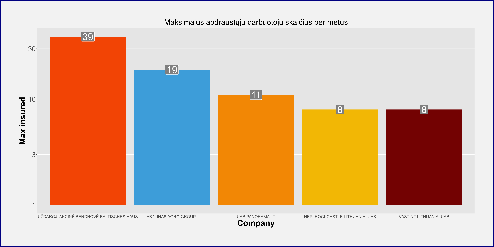

# R Laboratorinis darbas: duomenų vizualizacija

| Variantas | ecoActCode |
|------------- | ------------- |
|10   | 682000 |

### 1. Užduotis

Atsakymas:

Išvados: Įmonių vidutinių atlyginimų vidurkis yra 1094.3 €, minimumas - 4.5 €, maksimumas - 18386.8 €.

### 2. Užduotis

Atsakymas:

Išvados: Stabiliausias vidutinis atlyginimas UŽDAROSIOS AKCINĖS BENDROVĖS BALTISCHES HAUS.

### 3. Užduotis

Atsakymas:

Išvados: Daugiausia apdraustųjų darbuotojų turi UŽDAROJI AKCINĖ BENDROVĖ BALTISCHES HAUS, mažiausiai - NEPI ROCKCASTLE LITHUANIA, UAB ir VASTINT LITHUANIA, UAB

### 4. Užduotis

Shiny R aplikacijos nuotrauka:

